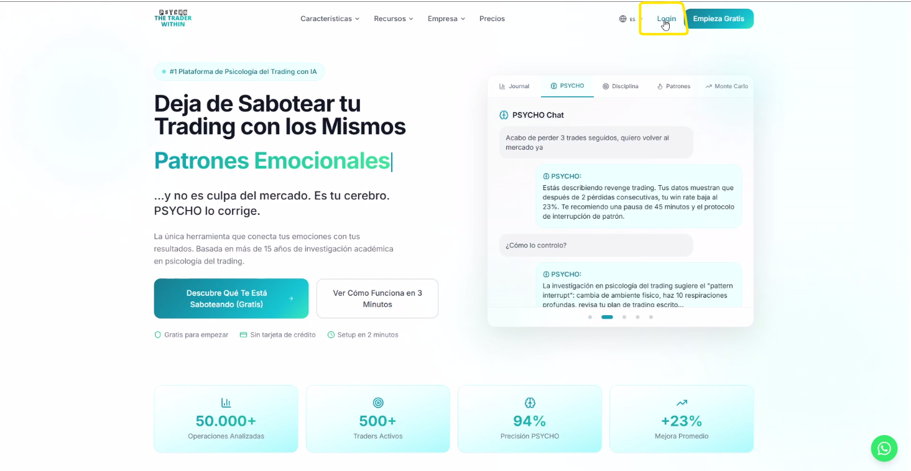

# Marco Grifa

### AI / Automation Engineer

I build production-grade, multi-tenant agentic systems end to end — from a hardened Linux VPS up to Claude-powered agents that run unattended. I ship solo: infrastructure, backend, AI orchestration, and UI. Unconventional path (conservatory-trained musician, international civil servant, professional trader) now fully channeled into engineering software that ships.

Remote · based in Guatemala · **open to relocation worldwide** · **open to work**

---

## What I build

### PSYCHO — trading-psychology web app (live)
A multi-tenant production web app for traders: 25+ feature pages, an AI mentoring chat (multi-thread, RAG-backed over 20k+ vectors), CSV trade import with broker auto-detection (Binance, Bybit, MetaTrader, Interactive Brokers), a prop-firm rule evaluator covering 8 real firms, Monte Carlo simulation, behavioral-fingerprint analytics, and a multi-tenant WhatsApp coaching bot on the Meta Business API. React + Vite + TypeScript + Tailwind front end, Flask + PostgreSQL/SQLite + JWT backend, Stripe billing. Deployed and operated on a self-managed VPS (Caddy + systemd) behind Cloudflare; ran a 5-dimension security audit and hardened the stack end to end.

**Live:** [psycho.lat](https://psycho.lat)

### presencIA / AgenteMIA — AI web agency (live)
A productized AI offering for small businesses: a proprietary, branded chatbot embedded on each client's landing page, backed by an agent server (MCP + OAuth services), live lead capture, and transactional email. Multi-tenant subpath deployment pattern reused across multiple client sites on shared, hardened infrastructure.

**Live:** [presencia.lat](https://presencia.lat) · [agentemia.it](https://agentemia.it)

### Speed-to-Lead — multi-channel lead-response platform
Multi-tenant backend that captures and responds to inbound leads across channels, with per-tenant configuration and Claude-driven conversation handling.

### Autonomous automation layer
Self-built "second brain": scheduled Claude Code agents that mirror chat transcripts and persistent memory into a knowledge base, poll multiple Git repositories and annotate project notes, and run nightly memory-consolidation jobs — all unattended via OS schedulers.

---

## Tech

**Languages** TypeScript / JavaScript · Python · SQL
**Frontend** React · Next.js · Vite · Tailwind CSS
**Backend** Node.js / Express · Python / FastAPI · Flask · PostgreSQL · REST · multi-tenant architecture
**AI / Agents** Claude API (tool use, agents, MCP) · Anthropic SDK · OpenAI API · RAG · prompt & context engineering · scheduled autonomous agents
**Integrations** Stripe · Meta / WhatsApp Business API · Resend · Composio · Cloudflare · Playwright
**Infra / DevOps** Linux VPS · Docker · Caddy · systemd · iptables hardening · Git · CI-style deploy pipelines
**Creative tech** Blender · Remotion (programmatic video) · AI image/video pipelines

---

## Background

Engineering and AI since 2024 (Intuit AI). Before that: independent futures trader and mentor (2018–2023); international civil-service roles in multilateral and EU organizations (2013–2018, 2023–2024); conservatory-trained musician and teacher (2003–2013); economics studies (1998–2003). The through-line: disciplined, structured systems thinking — and the ability to reinvent toward the goal.

Languages: Italian (native) · Spanish · English.

---

## Open to work

I'm looking for AI / automation engineering roles — remote or relocation, worldwide.

📧 lifemarcog@gmail.com · 📍 Guatemala (open to relocation)

📄 **[Full CV](CV.md)**
