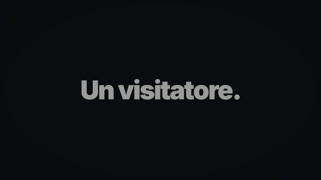
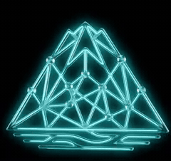
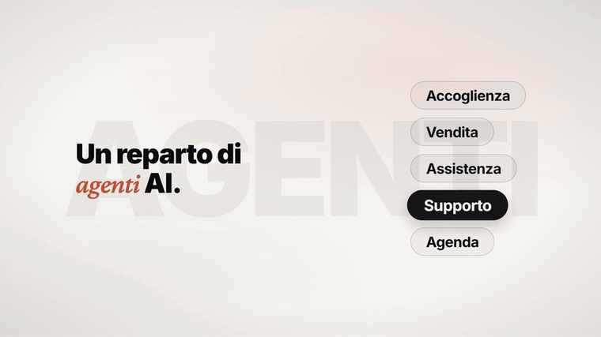
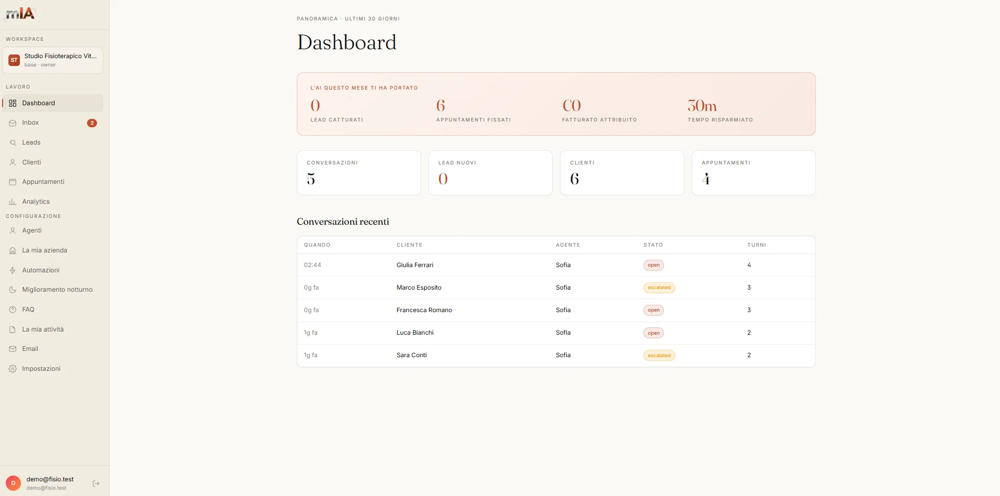
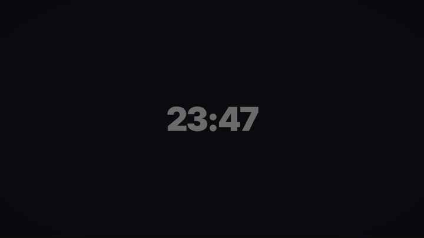
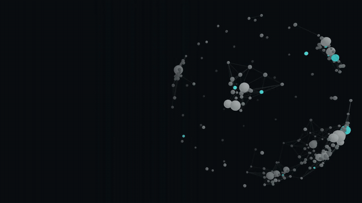
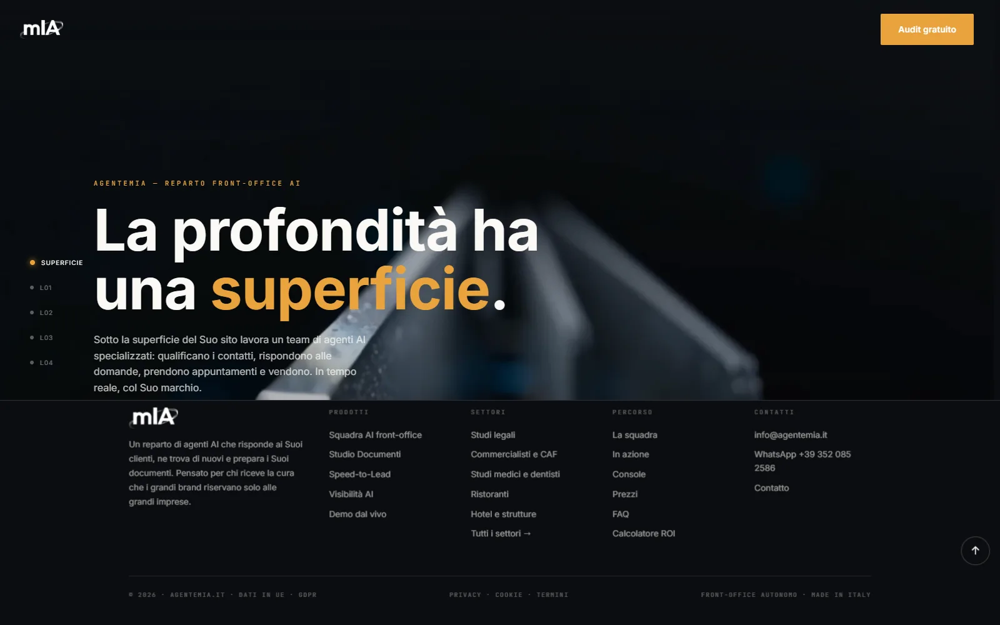
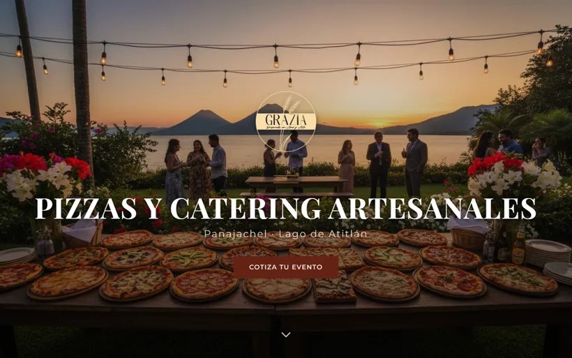
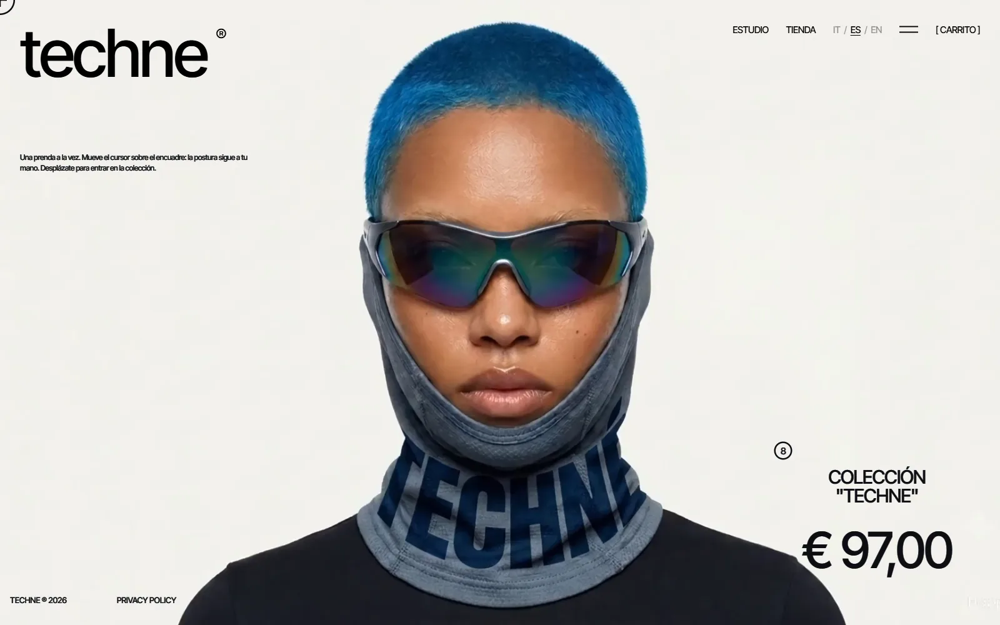

  

<h1 align="center">Intuit AI</h1>

<strong>AI-native software company. Real products, in production, run by one founder and a fleet of agents.</strong>

  
  
  

  
  
  
  

  

agentemIA campaign spot — the branded AI team answering on the client's own site. <a href="assets/spot-website-chat.mp4">▶ full spot</a> · <a href="assets/agentemia-reel-60s.mp4">▶ 60-second reel</a>

---

## What we ship

Three live products, one shared infrastructure, one operating principle: **software that ships and stays up.**
Every product below is in production, billing real customers, and operated end-to-end — from a hardened Linux VPS
to Claude-powered agents that run unattended.

| | Product | What it is | Live |
|---|---|---|---|
|  | **agentemIA** | The AI front-office department for Italian professionals and SMBs: branded website chat, an AI phone agent on an Italian number, custom landing pages — one inbox, one console. | [agentemia.it](https://agentemia.it) |
|  | **presencIA** | AI-powered web agency for boutique hotels and local businesses around Lake Atitlán, Guatemala: get found, get trusted, get booked. | [presencia.lat](https://presencia.lat) |
|  | **PSYCHO — The Trader Within** | Trading-psychology platform: AI mentor, trade journal with broker import, prop-firm rule evaluator, Monte Carlo, WhatsApp coaching. | [psycho.lat](https://psycho.lat) |

---

## agentemIA — *Velocità · Verticalità · Verità*

Not a chatbot. A department: five named agents that answer in chat on the client's website and on the phone on
the client's Italian number — in real time, day and night, holidays included. If they don't know, they say so
and hand off to a human.

<table align="center">
<tr>
<td align="center" width="120"> <strong>Sofia</strong> Reception</td>
<td align="center" width="120"> <strong>Daniel</strong> Sales</td>
<td align="center" width="120"> <strong>Lucia</strong> Care</td>
<td align="center" width="120"> <strong>Pablo</strong> Tech support (RAG)</td>
<td align="center" width="120"> <strong>Elena</strong> Calendar</td>
</tr>
</table>

  

The widget on a client's site: real question, request analysis, sector knowledge base, appointment proposal. Live.

<table align="center">
<tr>
<td width="50%" align="center"> <strong>The console</strong> — 8-state funnel, every channel in one inbox, real-time costs, nightly self-improvement of the agents.</td>
<td width="50%" align="center"> <strong>Every channel</strong> — site chat, phone, WhatsApp, Facebook; same inbox, same brand. <a href="assets/spot-phone-answering.mp4">▶ phone-agent spot</a></td>
</tr>
</table>

**Under the hood:** multi-tenant agent server (Claude API + MCP + OAuth services), Native DOM Integration (the
widget reads scroll, dwell time and UTM source and intervenes proactively), in-chat booking and forms (zero
redirect drop-off), 110 languages natively, adversarial stress-test on 15 sector-critical scenarios before every
go-live, Speed-to-Lead prospecting engine, Stripe billing, all data in the EU.

  
  
  
  

Public console demos — demo data, real product. Brand showcase repo: <a href="https://github.com/MGEncrypted/agentemia">MGEncrypted/agentemia</a>

---

## presencIA — get found, get trusted, get booked

  

The only agency on Lake Atitlán built exclusively for boutique hotels and hospedajes — and the first one where AI
does the work of three people. Three systems instead of six services: **Presencia** (website, SEO, Google
Business Profile), **Reputación** (review management, OTA cleanup, social), **Conversión** (24/7 AI chatbot on
WhatsApp and web, direct bookings, fewer OTA commissions).

<table align="center">
<tr>
<td align="center" width="20%"> agentemIA</td>
<td align="center" width="20%"> Grazia · Panajachel</td>
<td align="center" width="20%"> PSYCHO</td>
<td align="center" width="20%"> Techne</td>
<td align="center" width="20%"> Zavala</td>
</tr>
</table>

Portfolio — every site ships with the branded AI agent embedded. <a href="assets/presencia-founders.mp4">▶ founders spot</a>

---

## PSYCHO — The Trader Within

  

A multi-tenant production web app for traders: 25+ feature pages, an AI mentoring chat (multi-thread, RAG over
20k+ vectors of trading psychology and market-structure material), CSV trade import with broker auto-detection
(Binance, Bybit, MetaTrader, Interactive Brokers, NinjaTrader, Tradovate, Rithmic…), a prop-firm rule evaluator
covering 8 real firms, Monte Carlo simulation, behavioral-fingerprint analytics, and a multi-tenant WhatsApp
coaching bot on the Meta Business API.

<table align="center">
<tr>
<td align="center" width="33%"> <strong>AI mentor</strong> — RAG-backed, multi-thread</td>
<td align="center" width="33%"> <strong>Journal</strong> — broker import, behavioral fingerprint</td>
<td align="center" width="33%"> <strong>Prop-firm evaluator</strong> — 8 real firms' rulebooks</td>
</tr>
</table>

React + Vite + TypeScript + Tailwind · Flask + PostgreSQL + JWT · Stripe · Caddy + systemd on a self-managed
VPS behind Cloudflare · 5-dimension security audit, stack hardened end to end.

---

## How it's built

| Layer | Stack |
|---|---|
| **AI / agents** | Claude API (tool use, agents, MCP) · Anthropic SDK · OpenAI · Gemini · RAG · scheduled autonomous agents (Claude Code) · adversarial eval before go-live |
| **Frontend** | TypeScript · React · Next.js · Vite · Tailwind |
| **Backend** | Node.js / Express · Python / FastAPI · Flask · PostgreSQL · multi-tenant subpath deployment |
| **Integrations** | Stripe · Meta / WhatsApp Business API · telephony · Google / Outlook Calendar · Resend · HubSpot / Pipedrive · Cloudflare · Playwright |
| **Infra** | Linux VPS · Docker · Caddy · systemd · PM2 · iptables hardening · Netlify · CI-style deploy pipelines |
| **Content pipeline** | Remotion (programmatic video) · Blender · AI image/video/UGC pipelines — the spots on this page are generated in-house |
| **Second brain** | Obsidian vault kept in sync by unattended agents: chat transcripts, memory consolidation, repo polling — <a href="https://github.com/MGEncrypted/claude-obsidian-sync">claude-obsidian-sync</a> (open source) |

  
  
  
  
  
  
  
  
  
  

---

## Who's behind it

**Marco Grifa** — founder, and the only human on the team. Conservatory-trained musician, years in
international civil service (multilateral and EU organizations), then professional futures trader and mentor;
building AI software full-time since 2024. Italian (native) · Spanish · English. Based in Guatemala, working
with Italy and LATAM.

The rest of the team is agents: Claude Code as technical co-founder, an autonomous Claude instance on the VPS,
and scheduled workers for content, monitoring and memory. Most of what you see in the contribution graph is
that collaboration.

---

  
  
  

<strong>Intuit AI</strong> · agentemia.it · presencia.lat · psycho.lat Public showcase only — no source, no infrastructure, no secrets in this repository.

